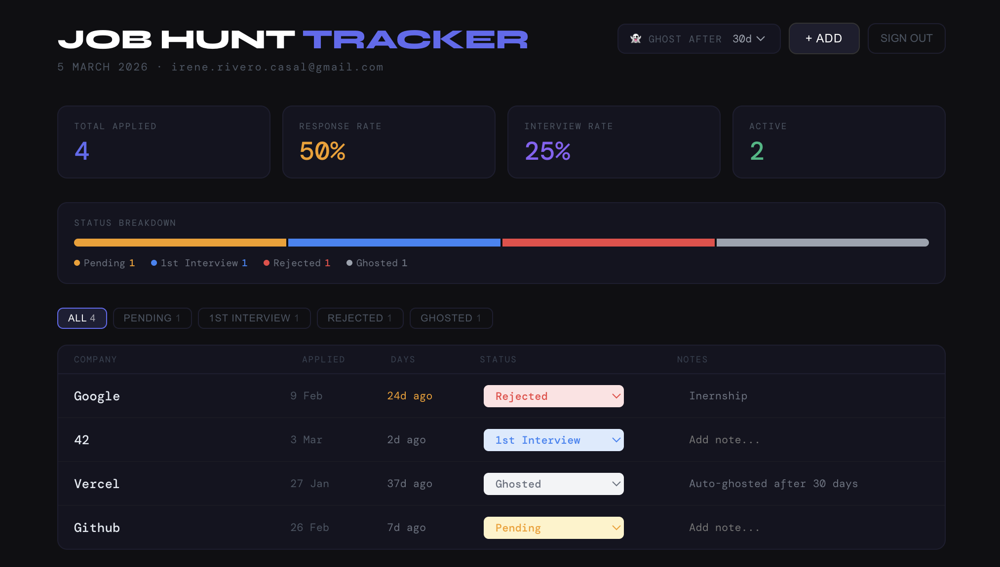

# 📊 Job Hunt Tracker

A full-stack personal job application tracker with cloud sync, authentication, and automated deployment. Built as a real DevOps learning project.

**Live demo:** `https://job-tracker-co48.vercel.app/`



---

## ✨ Features

- 🔐 **Authentication** — private login so only you can access your data
- ☁️ **Cloud sync** — data saved to PostgreSQL via Supabase, accessible from any device
- 📊 **Live stats** — response rate, interview rate, active applications
- 👻 **Auto-ghost** — pending apps automatically marked as ghosted after X days with no response
- 🎨 **Status tracking** — full pipeline from Pending → Interview → Offer / Rejected
- 📝 **Inline notes** — add notes to any application directly in the table
- 🔒 **Row Level Security** — database-level protection, users can only see their own data

---

## 🛠️ Tech Stack

| Layer | Technology |
|---|---|
| Frontend | React |
| Database | Supabase (PostgreSQL) |
| Authentication | Supabase Auth |
| Hosting | Vercel |
| CI/CD | GitHub → Vercel (auto-deploy on push) |

---

## 🏗️ Architecture

```
┌─────────────┐     push      ┌─────────────┐    auto-deploy   ┌─────────────┐
│  Local Dev  │ ────────────► │   GitHub    │ ───────────────► │   Vercel    │
│ (React app) │               │ (main repo) │                  │  (live URL) │
└─────────────┘               └─────────────┘                  └─────────────┘
                                                                       │
                                                                  browser request
                                                                       │
                                                                       ▼
                                                               ┌──────────────┐
                                                               │   Supabase   │
                                                               │  PostgreSQL  │
                                                               │   + Auth     │
                                                               └──────────────┘
```

**CI/CD flow:** every `git push` to `main` triggers an automatic Vercel build and deploy. No manual steps needed.

---

## 🔒 Security

- Users must authenticate before seeing any data
- Supabase **Row Level Security (RLS)** ensures each user only ever queries their own rows — enforced at the database level, not just the app level
- Secrets (Supabase URL and API key) are stored as environment variables — never hardcoded in the repo
- Database policy:

```sql
create policy "Users can only access their own data"
  on applications
  for all
  using (auth.uid() = user_id);
```

---

## 🚀 Run it yourself

### Prerequisites
- Node.js 18+
- A free [Supabase](https://supabase.com) account
- A free [Vercel](https://vercel.com) account

### 1. Clone the repo

```bash
git clone https://github.com/irrivero/job-tracker.git
cd job-tracker
npm install
```

### 2. Set up Supabase

Create a new Supabase project, then run this in the **SQL Editor**:

```sql
create table applications (
  id uuid default gen_random_uuid() primary key,
  user_id uuid references auth.users not null,
  company text not null,
  applied_date date not null,
  status text not null default 'pending',
  notes text default '',
  created_at timestamp with time zone default now()
);

alter table applications enable row level security;

create policy "Users can manage their own applications"
  on applications
  for all
  using (auth.uid() = user_id);
```

### 3. Add environment variables

Create a `.env` file in the project root:

```
REACT_APP_SUPABASE_URL=your_supabase_project_url
REACT_APP_SUPABASE_ANON_KEY=your_supabase_anon_key
```

Find these in your Supabase project under **Settings → API**.

### 4. Run locally

```bash
npm start
```

### 5. Deploy to Vercel

1. Push to GitHub
2. Import the repo on [vercel.com](https://vercel.com)
3. Add the same environment variables in Vercel project settings
4. Deploy — done!

From this point, every `git push` auto-deploys. ✅

---

## 📁 Project Structure

```
job-tracker/
├── public/
├── src/
│   └── App.js        ← entire app (auth + tracker UI + Supabase integration)
├── .env              ← local secrets (gitignored)
├── .gitignore
├── package.json
└── README.md
```

---

## 🧠 What I learned

- Setting up a full **CI/CD pipeline** with GitHub and Vercel
- **Supabase** — PostgreSQL database, built-in auth, and Row Level Security
- Managing **environment variables** across local dev and production
- **React** state management with hooks
- Keeping secrets out of version control